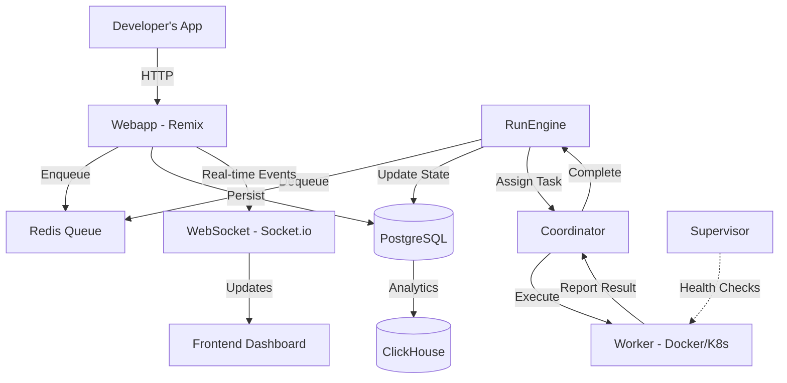
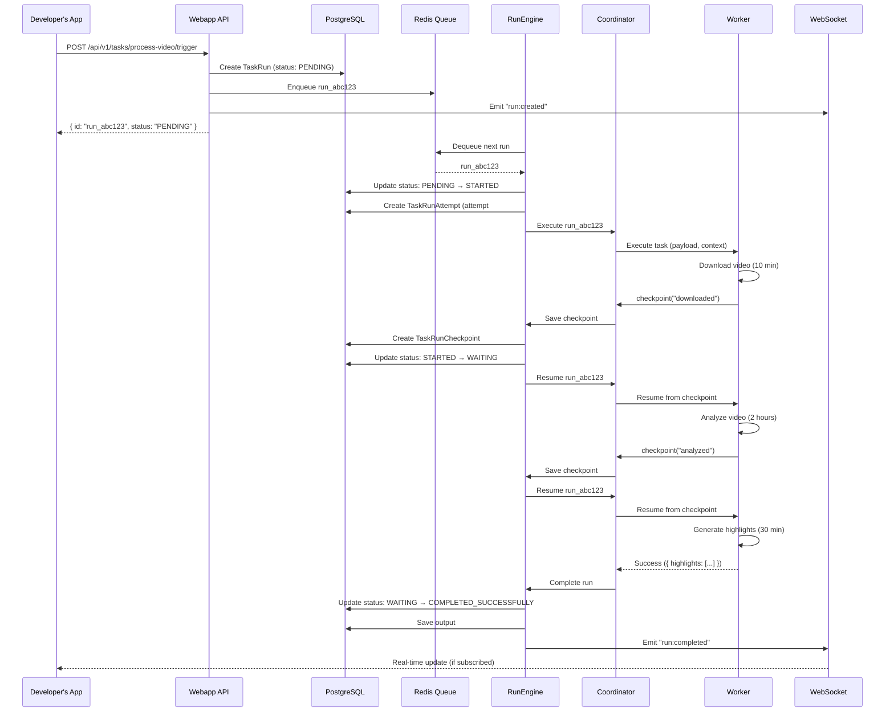

# Understanding Trigger.dev: Architecture and Core Concepts

**Part 1 of 5** in the "Building Durable AI Workflows" series
**Reading Time:** 12 minutes
**Author:** Technical Analysis Team
**Analysis Commit:** [`19fa669`](https://github.com/triggerdotdev/trigger.dev/commit/19fa66931819371d607eff001b561aa783547734)

---

## The Serverless Timeout Problem

Imagine you're building an AI agent that analyzes hours of video content, generates summaries, and creates highlight reels. You deploy it to AWS Lambda, and everything works beautifully... until it doesn't. After exactly 15 minutes, Lambda terminates your function mid-processing. Your partially analyzed video is lost. You start over. The same thing happens.

This is the fundamental limitation of serverless platforms: **execution timeouts**. AWS Lambda maxes out at 15 minutes. Vercel functions: 5 minutes (or 15 with Pro). Cloudflare Workers: 30 seconds. These platforms were designed for request-response patterns, not long-running workloads.

**Enter Trigger.dev**: a platform specifically designed for tasks that take minutes, hours, or even days. No timeouts. No arbitrary limits. Just durable, observable, long-running execution.

In this post, we'll explore how Trigger.dev achieves this through a carefully architected system of microservices, durable execution, and strategic use of checkpoints.

---

## What You'll Learn

By the end of this post, you'll understand:
- Trigger.dev's high-level architecture and component interactions
- Core domain concepts (tasks, runs, checkpoints, queues)
- How a task flows from trigger to completion
- The architectural patterns that enable durability and scalability
- How Trigger.dev compares to alternatives like Temporal and AWS Step Functions

---

## Core Concepts: The Domain Model

Before diving into architecture, let's establish the vocabulary. Trigger.dev's domain model centers around a few key concepts:

### Task

A **task** is a user-defined function that can be triggered, retried, and monitored. Think of it as a serverless function, but with superpowers.

```typescript
import { task } from "@trigger.dev/sdk/v3";

export const processVideo = task({
  id: "process-video",
  // Maximum 2 vCPU, 4 GB RAM for this task
  machine: "large",
  // Retry up to 3 times on failure
  retry: {
    maxAttempts: 3,
    factor: 2
  },
  run: async (payload: { videoUrl: string }, ctx) => {
    // Download video (may take 10 minutes)
    const video = await downloadVideo(payload.videoUrl);

    // Checkpoint: if we crash here, we resume from this point
    await ctx.checkpoint("downloaded");

    // Process video (may take hours)
    const analyzed = await analyzeVideo(video);
    await ctx.checkpoint("analyzed");

    // Generate highlights
    const highlights = await generateHighlights(analyzed);

    return { highlights, duration: analyzed.duration };
  }
});
```

**Key file:** [`packages/trigger-sdk/src/v3/shared.ts`](https://github.com/triggerdotdev/trigger.dev/blob/19fa66931819371d607eff001b561aa783547734/packages/trigger-sdk/src/v3/shared.ts)

### Run

A **run** is a single execution instance of a task. When you trigger a task, you create a run.

```typescript
// Trigger a run (fire-and-forget)
const run = await processVideo.trigger({
  videoUrl: "https://example.com/video.mp4"
});

console.log(run.id); // "run_abc123"

// Or trigger and wait for the result
const result = await processVideo.triggerAndWait({
  videoUrl: "https://example.com/video.mp4"
});

console.log(result.output); // { highlights: [...], duration: 3600 }
```

Each run has:
- Unique ID (`run_abc123`)
- Status (PENDING → EXECUTING → COMPLETED_SUCCESSFULLY)
- Input payload
- Output result
- Execution trace (distributed tracing)

**Database model:** [`TaskRun`](https://github.com/triggerdotdev/trigger.dev/blob/19fa66931819371d607eff001b561aa783547734/internal-packages/database/prisma/schema.prisma)

### Checkpoint

A **checkpoint** is a saved execution state. It's what makes Trigger.dev different from traditional serverless.

When you call `await checkpoint("name")`, the system:
1. Serializes your task's current execution state
2. Persists it to PostgreSQL
3. Pauses execution
4. Releases the worker (which can take other tasks)

If your task crashes, it **resumes from the last checkpoint** instead of starting over.

```typescript
run: async (payload, ctx) => {
  const data = await expensiveOperation(); // Takes 30 minutes
  await ctx.checkpoint("step1");           // Save state

  const result = await anotherOperation(data); // Takes 1 hour
  await ctx.checkpoint("step2");

  return result;
}
```

**Implementation:** [`internal-packages/run-engine/src/engine/systems/checkpointSystem.ts`](https://github.com/triggerdotdev/trigger.dev/blob/19fa66931819371d607eff001b561aa783547734/internal-packages/run-engine/src/engine/index.ts) (~57KB)

### Queue

A **queue** groups tasks with shared concurrency limits.

```typescript
import { queue, task } from "@trigger.dev/sdk/v3";

// Allow max 5 concurrent API calls
const apiQueue = queue({
  name: "external-api",
  concurrencyLimit: 5
});

export const callExternalAPI = task({
  id: "call-api",
  queue: apiQueue, // Joins this queue
  run: async (payload) => {
    return await fetch(payload.url);
  }
});
```

Queues prevent resource exhaustion and provide fine-grained control over execution.

---

## System Architecture

Now that we understand the domain model, let's see how it all fits together.

### High-Level Overview



### Component Breakdown

#### 1. Webapp (Remix Full-Stack Application)

**Location:** `apps/webapp/`
**Responsibilities:**
- REST API for task triggering ([`/api/v1/tasks/:taskId/trigger`](https://github.com/triggerdotdev/trigger.dev/blob/19fa66931819371d607eff001b561aa783547734/apps/webapp/app/routes))
- Dashboard UI for monitoring runs
- Real-time updates via Socket.io
- User authentication and organization management

**Technology:**
- **Remix 2.1** (React framework)
- **Prisma** (ORM for PostgreSQL)
- **Socket.io** (WebSocket server)
- **OpenTelemetry** (observability)

**Example API flow:**
```typescript
// User triggers task via SDK
await myTask.trigger({ data: "..." });

// SDK makes HTTP request:
POST /api/v1/tasks/my-task/trigger
Authorization: Bearer sk_prod_abc123
{
  "payload": { "data": "..." },
  "options": { "idempotencyKey": "unique-key" }
}

// Webapp handler (simplified):
export async function action({ request, params }: ActionArgs) {
  const { payload, options } = await request.json();

  // Create TaskRun in database
  const run = await prisma.taskRun.create({
    data: {
      id: cuid(),
      status: "PENDING",
      payload: JSON.stringify(payload),
      taskIdentifier: params.taskId,
      // ... other fields
    }
  });

  // Enqueue to Redis
  await runQueue.enqueue(run.id);

  // Emit real-time event
  io.emit(`run:${run.id}`, { type: "created", run });

  return json({ id: run.id, status: run.status });
}
```

**Key insight:** The webapp is **stateless** and horizontally scalable. All state lives in PostgreSQL/Redis.

#### 2. RunEngine (Execution Orchestrator)

**Location:** `internal-packages/run-engine/`
**Responsibilities:**
- Dequeue runs from Redis
- Manage run lifecycle (PENDING → STARTED → EXECUTING → COMPLETED)
- Handle retries with exponential backoff
- Coordinate checkpoints and resumption
- Track attempt history

**Key systems** (implemented as subsystems within RunEngine):
```typescript
class RunEngine {
  private dequeueSystem: DequeueSystem;
  private runAttemptSystem: RunAttemptSystem;
  private checkpointSystem: CheckpointSystem;
  private retrySystem: RetrySystem;
  private batchSystem: BatchSystem;

  async dequeueAndExecute() {
    // 1. Dequeue run from Redis queue
    const run = await this.dequeueSystem.dequeue();
    if (!run) return;

    // 2. Acquire distributed lock (prevent duplicate execution)
    const locked = await this.acquireLock(run.id);
    if (!locked) return;

    // 3. Create attempt
    const attempt = await this.runAttemptSystem.create(run);

    // 4. Assign to worker via Coordinator
    await this.coordinator.execute(run, attempt);

    // 5. Handle result (success/failure/checkpoint)
    await this.handleResult(run, attempt);
  }
}
```

**Key file:** [`internal-packages/run-engine/src/engine/index.ts`](https://github.com/triggerdotdev/trigger.dev/blob/19fa66931819371d607eff001b561aa783547734/internal-packages/run-engine/src/engine/index.ts) (~57KB)

#### 3. Coordinator (Worker Orchestrator)

**Location:** `apps/coordinator/`
**Responsibilities:**
- Maintain worker pool
- Route tasks to available workers
- Handle task execution lifecycle
- Manage communication between RunEngine and Workers

**Flow:**
```typescript
class Coordinator {
  async execute(run: TaskRun, attempt: TaskRunAttempt) {
    // 1. Find available worker
    const worker = await this.findWorker(run.machine);

    // 2. Prepare execution packet
    const packet = {
      runId: run.id,
      attemptId: attempt.id,
      payload: run.payload,
      environment: run.environment.variables,
      traceContext: run.traceContext,
    };

    // 3. Send to worker via gRPC/HTTP
    const result = await worker.execute(packet);

    // 4. Report back to RunEngine
    await this.runEngine.handleResult(run, attempt, result);
  }
}
```

**Key file:** [`apps/coordinator/src/index.ts`](https://github.com/triggerdotdev/trigger.dev/blob/19fa66931819371d607eff001b561aa783547734/apps/coordinator/src/index.ts)

#### 4. Worker (Task Executor)

**Location:** `apps/docker-provider/` or `apps/kubernetes-provider/`
**Responsibilities:**
- Execute user task code in isolated containers/pods
- Stream logs back to platform
- Report execution results (success/failure/checkpoint)

**Execution:**
```typescript
// Inside worker container
import { processVideo } from "./tasks";

const result = await processVideo.run(payload, {
  runId: "run_abc123",
  logger: structuredLogger,
  checkpoint: async (name) => {
    await saveCheckpoint(name);
  },
  // ... other context
});

// Report result back to Coordinator
await coordinator.reportResult({
  runId: "run_abc123",
  status: "SUCCESS",
  output: result,
});
```

#### 5. Supervisor (Health Monitor)

**Location:** `apps/supervisor/`
**Responsibilities:**
- Monitor worker health (CPU, memory, liveness)
- Detect failures and trigger recovery
- Provide metrics for auto-scaling

---

## Complete Execution Flow

Let's trace a task from trigger to completion:



**Total execution time:** ~3 hours
**Timeouts:** 0 (none)
**Automatic recovery:** Yes (from checkpoints)

---

## Architectural Patterns

Trigger.dev employs several well-known patterns:

### 1. Event-Driven Architecture (EDA)

Components communicate via events, not direct calls. This enables:
- **Loose coupling:** Services don't need to know about each other
- **Scalability:** Add more workers without changing the webapp
- **Resilience:** Events can be retried if a service is down

**Example:**
```typescript
// Webapp emits event
io.emit("run:status-changed", { runId, status: "COMPLETED" });

// Frontend subscribes
socket.on("run:status-changed", (data) => {
  updateUI(data.runId, data.status);
});
```

### 2. Domain-Driven Design (DDD)

Domain concepts (Task, Run, Checkpoint) are first-class citizens in the codebase, not just database tables.

**Aggregate roots:**
- `TaskRun` is an aggregate root that manages `TaskRunAttempt`s
- Invariant: A run can't complete if it has pending attempts
- Repository pattern: `TaskRunRepository` abstracts database access

### 3. CQRS (Command Query Responsibility Segregation)

Writes (triggering tasks) and reads (querying run status) use different models:
- **Commands:** Trigger, retry, cancel (modify state)
- **Queries:** Get run, list runs (read-only, potentially from read replicas)
- **Analytics:** ClickHouse for complex queries (separate from operational DB)

### 4. Saga Pattern (Orchestration)

The Coordinator orchestrates multi-step task execution:
1. Execute task code
2. Save checkpoint (if requested)
3. Pause execution
4. Resume from checkpoint

This is **orchestration** (centralized) vs. **choreography** (distributed).

---

## How Trigger.dev Compares

### vs. AWS Step Functions

| Feature | Trigger.dev | AWS Step Functions |
|---------|-------------|-------------------|
| **Max duration** | Unlimited | 1 year (Standard) |
| **Checkpointing** | Manual (via SDK) | Automatic (state machine) |
| **Language** | TypeScript/JavaScript | JSON (state machine) |
| **Local development** | `trigger dev` | Limited (Step Functions Local) |
| **Pricing** | Per-minute execution | Per state transition |

**When to use Trigger.dev:** TypeScript-native, long-running AI workflows, local dev
**When to use Step Functions:** AWS-native, compliance requirements, visual workflows

### vs. Temporal

| Feature | Trigger.dev | Temporal |
|---------|-------------|----------|
| **Language support** | TypeScript, Python (beta) | Go, Java, Python, TypeScript, PHP |
| **Self-hosted** | Yes (Docker/K8s) | Yes (complex) |
| **Cloud offering** | Yes (trigger.dev) | Yes (Temporal Cloud) |
| **State persistence** | Manual checkpoints | Automatic (event sourcing) |
| **Learning curve** | Low (familiar SDK) | High (workflow/activity concepts) |

**When to use Trigger.dev:** Quick setup, TypeScript projects, modern DX
**When to use Temporal:** Polyglot teams, complex state machines, enterprise scale

### vs. Inngest

| Feature | Trigger.dev | Inngest |
|---------|-------------|---------|
| **Execution model** | Container-based | Function-based |
| **Checkpointing** | Explicit | Automatic (step functions) |
| **Real-time streaming** | Yes (streams API) | No |
| **Build extensions** | Yes (Prisma, Puppeteer, etc.) | Limited |

**When to use Trigger.dev:** Long-running tasks, custom dependencies
**When to use Inngest:** Event-driven workflows, simpler use cases

---

## Trade-offs and Design Decisions

Every architecture involves trade-offs. Here are Trigger.dev's key decisions:

### ✅ Chosen: Manual Checkpoints (vs. Automatic)

**Pros:**
- Developer controls checkpoint granularity
- Smaller checkpoint state (only save what's needed)
- More transparent (you see where state is saved)

**Cons:**
- Developer must remember to checkpoint
- More verbose code
- Potential for missed checkpoints

**Alternative:** Temporal's automatic checkpointing (via event sourcing)

### ✅ Chosen: Container-Based Workers (vs. Isolates)

**Pros:**
- Full Node.js runtime (all npm packages work)
- Custom system dependencies (FFmpeg, Chrome)
- Familiar development model

**Cons:**
- Slower cold starts (~2-5s vs. <100ms for isolates)
- Higher memory overhead per worker

**Alternative:** Cloudflare Workers' isolate model (faster, but more restrictive)

### ✅ Chosen: PostgreSQL + Redis (vs. Event Sourcing)

**Pros:**
- Familiar technology stack
- Easy to query and debug
- Good performance with proper indexing

**Cons:**
- No built-in audit log of all state changes
- More complex to implement certain patterns (replay)

**Alternative:** Event sourcing (Temporal's approach) for complete history

---

## Key Takeaways

1. **Trigger.dev solves the serverless timeout problem** through durable execution and checkpoints
2. **Event-driven microservices** (Webapp, RunEngine, Coordinator, Workers) enable scalability
3. **Manual checkpoints** give developers control over durability vs. performance trade-offs
4. **Domain-Driven Design** keeps complex business logic organized and maintainable
5. **Modern observability** (OpenTelemetry) is baked in from day one

---

## Try It Yourself

Ready to build your first durable task? Try this example:

```typescript
import { task } from "@trigger.dev/sdk/v3";

export const longRunningTask = task({
  id: "long-task",
  run: async (payload: { iterations: number }, ctx) => {
    for (let i = 0; i < payload.iterations; i++) {
      await sleep(60000); // Sleep 1 minute

      ctx.logger.info(`Iteration ${i + 1} complete`);

      // Checkpoint every 10 iterations
      if (i % 10 === 0) {
        await ctx.checkpoint(`iteration-${i}`);
      }
    }

    return { completed: payload.iterations };
  }
});

// Trigger it
await longRunningTask.trigger({ iterations: 100 });
// This will run for 100 minutes without timing out!
```

**Next steps:**
1. Visit [trigger.dev/docs/quick-start](https://trigger.dev/docs/quick-start) to set up your first project
2. Read [Part 2: The Checkpoint-Resume System](./02-deep-dive-checkpoint-resume.md) for implementation details
3. Explore the [codebase on GitHub](https://github.com/triggerdotdev/trigger.dev)

---

## Further Reading

- **Official Docs:** https://trigger.dev/docs
- **GitHub Repository:** https://github.com/triggerdotdev/trigger.dev
- **Discord Community:** https://trigger.dev/discord
- **Part 2 of this series:** Deep Dive into the Checkpoint-Resume System →

---

**Did you find this useful?** Star the [repository](https://github.com/triggerdotdev/trigger.dev), join the [Discord](https://trigger.dev/discord), or share this post with your team!
