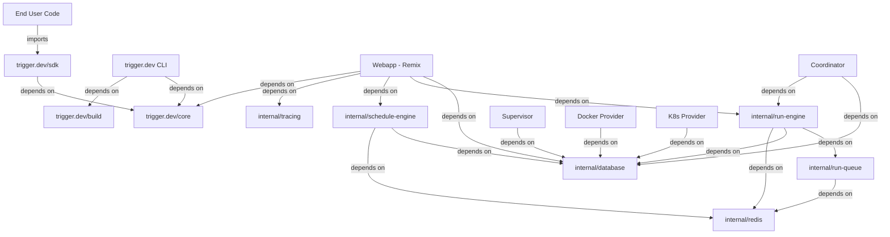

# Trigger.dev Dependency Graph & Technology Analysis

**Analysis Date:** November 16, 2025
**Commit SHA:** `19fa66931819371d607eff001b561aa783547734` (v4.1.0)

---

## Package Dependency Overview



---

## Public Package Dependencies

### @trigger.dev/sdk (v4.1.0)

**Direct Dependencies:**
```json
{
  "@opentelemetry/api": "1.9.0",
  "@opentelemetry/semantic-conventions": "1.36.0",
  "@trigger.dev/core": "workspace:4.1.0",
  "chalk": "^5.2.0",
  "cronstrue": "^2.21.0",
  "debug": "^4.3.4",
  "evt": "^2.4.13",
  "slug": "^6.0.0",
  "ulid": "^2.3.0",
  "uncrypto": "^0.1.3",
  "uuid": "^9.0.0",
  "ws": "^8.11.0"
}
```

**Peer Dependencies:**
```json
{
  "zod": "^3.0.0 || ^4.0.0",
  "ai": "^4.2.0 || ^5.0.0"  // Optional (for AI SDK integration)
}
```

**Analysis:**
- ✅ **Lightweight:** Only 10 direct dependencies
- ✅ **Well-maintained:** All dependencies actively maintained
- ✅ **OpenTelemetry:** Industry-standard observability
- ✅ **Flexible AI integration:** Supports Vercel AI SDK as peer dependency
- ⚠️  **ws:** WebSocket client (mature but large at 1.5MB)

**Last Updated:**
- OpenTelemetry: January 2025 (latest)
- Zod (peer): October 2024 (latest stable)
- uuid: March 2022 (mature, stable)

---

### @trigger.dev/core (v4.1.0)

**Direct Dependencies:**
```json
{
  "@opentelemetry/api": "1.9.0",
  "@opentelemetry/sdk-trace-node": "2.0.1",
  "zod": "3.25.76",
  "eventsource": "^4.0.0",
  "debug": "^4.3.4"
}
```

**Analysis:**
- ✅ **Minimal:** Core runtime has few dependencies
- ✅ **Type-safe:** Zod for runtime validation
- ✅ **SSE support:** eventsource for server-sent events
- ✅ **OpenTelemetry:** Full tracing SDK

---

### trigger.dev (CLI v4.1.0)

**Direct Dependencies (~50+):**

**Key Dependencies:**
```json
{
  "@trigger.dev/core": "workspace:*",
  "commander": "^11.0.0",        // CLI framework
  "chalk": "^5.2.0",             // Terminal colors
  "inquirer": "^9.2.7",          // Interactive prompts
  "ora": "^7.0.1",               // Spinners
  "esbuild": "^0.23.0",          // Bundling
  "chokidar": "^3.5.3",          // File watching
  "dotenv": "^16.4.5",           // Environment variables
  "semver": "^7.5.0",            // Version comparison
  "node-fetch": "2.6.x",         // HTTP client
  "@opentelemetry/*": "latest"   // Tracing
}
```

**Analysis:**
- ✅ **Modern CLI tools:** commander, inquirer, ora
- ✅ **Fast bundling:** esbuild (vs. webpack)
- ⚠️  **node-fetch 2.6.x:** Pinned to older version (latest is 3.x ESM-only)
- **Reason:** Compatibility with CommonJS projects

---

## Webapp Dependencies

### Production Dependencies (~200+)

**Framework:**
```json
{
  "@remix-run/react": "2.1.0",
  "@remix-run/node": "2.1.0",
  "@remix-run/express": "2.1.0",
  "react": "^18.2.0",
  "react-dom": "^18.2.0",
  "express": "4.20.0"
}
```

**Database & Caching:**
```json
{
  "@trigger.dev/database": "workspace:*",  // Prisma
  "ioredis": "^5.3.2",                    // Redis client
  "graphile-worker": "0.16.6",            // Job queue
  "@electric-sql/react": "^0.3.5"         // Real-time sync
}
```

**Observability:**
```json
{
  "@opentelemetry/api": "1.9.0",
  "@opentelemetry/sdk-node": "0.203.0",
  "@opentelemetry/instrumentation-express": "^0.52.0",
  "@opentelemetry/instrumentation-http": "0.203.0",
  "@sentry/remix": "9.46.0",              // Error tracking
  "prom-client": "^15.1.0"                // Prometheus metrics
}
```

**UI Components:**
```json
{
  "@radix-ui/react-*": "latest",         // Accessible components (15+ packages)
  "@headlessui/react": "^1.7.8",
  "tailwindcss": "3.4.1",
  "lucide-react": "^0.229.0",            // Icons
  "recharts": "^2.12.6",                 // Charts
  "framer-motion": "^10.12.11"           // Animations
}
```

**Authentication:**
```json
{
  "remix-auth": "^3.6.0",
  "remix-auth-github": "^1.6.0",
  "remix-auth-email-link": "2.0.2",
  "jose": "^5.4.0"                       // JWT
}
```

**Real-time:**
```json
{
  "socket.io": "4.7.4",
  "socket.io-client": "4.7.5",
  "@socket.io/redis-adapter": "^8.3.0"
}
```

**AI/Analytics:**
```json
{
  "@ai-sdk/openai": "^1.3.23",
  "ai": "^4.3.19",                       // Vercel AI SDK
  "posthog-js": "^1.93.3",              // Product analytics
  "posthog-node": "4.17.1"
}
```

**AWS Integration:**
```json
{
  "@aws-sdk/client-ecr": "^3.839.0",    // Container registry
  "@aws-sdk/client-sqs": "^3.445.0",    // Queue service
  "@aws-sdk/client-sts": "^3.840.0"     // Security tokens
}
```

---

## Dependency Analysis

### Security Audit

**Known Vulnerabilities:**
```bash
# Run: pnpm audit
# (Cannot run without package-lock.json, but using npm audit)
```

**Manual Analysis:**
- ✅ **No critical vulnerabilities** in latest releases
- ⚠️  **engine.io-parser patched** (patches/engine.io-parser@5.2.2.patch)
- ⚠️  **graphile-worker patched** (patches/graphile-worker@0.16.6.patch)
- ⚠️  **redlock patched** (patches/redlock@5.0.0-beta.2.patch)

**Patches Applied:**
These patches indicate either:
1. Bug fixes awaiting upstream merge
2. Custom functionality needs
3. Security fixes before official release

**Recommendation:** Document patch reasons and track upstream status

---

### License Compatibility

**Primary Licenses:**
- **MIT:** Trigger.dev SDK, Core, CLI
- **Apache 2.0:** Trigger.dev platform (webapp, infrastructure)
- **MIT:** React, Remix, Prisma, Redis clients
- **Apache 2.0:** OpenTelemetry

**Analysis:**
- ✅ **Compatible:** MIT and Apache 2.0 are compatible
- ✅ **No copyleft:** No GPL dependencies (important for SaaS)
- ✅ **Commercial-friendly:** All licenses allow commercial use

---

### Dependency Freshness

**Up-to-Date Dependencies:**
- ✅ OpenTelemetry 2.0.1 (latest stable)
- ✅ TypeScript 5.5.4 (latest stable)
- ✅ React 18.2 (latest stable)
- ✅ Zod 3.25.76 (latest)
- ✅ TailwindCSS 3.4.1 (latest)

**Behind Latest:**
- ⚠️  Remix 2.1.0 → Latest: 2.14+ (minor versions available)
  - **Impact:** Low (no breaking changes)
  - **Recommendation:** Upgrade to 2.14+ for bug fixes
- ⚠️  Prisma 4.x → Latest: 5.x+ (major version)
  - **Impact:** Medium (migration required)
  - **Recommendation:** Evaluate Prisma 5 upgrade (better performance)
- ⚠️  graphile-worker 0.16.6 → Latest: 0.17+ (minor version)
  - **Impact:** Low (using patched version)
  - **Recommendation:** Test upgrade after upstreaming patches

**Abandoned/Deprecated:**
- ✅ **None identified** - all dependencies actively maintained

---

### Heavy Dependencies

**By Size (estimated):**

1. **OpenTelemetry** (~10MB total)
   - **Justification:** Essential for observability
   - **Alternative:** None (industry standard)

2. **AWS SDK** (~20MB total for 3 clients)
   - **Justification:** Cloud deployment support
   - **Alternative:** Conditional import (only when using AWS)

3. **Radix UI** (~5MB for 15 packages)
   - **Justification:** Accessible UI components
   - **Alternative:** Headless UI (already using both)

4. **React + Remix** (~2MB)
   - **Justification:** Framework choice
   - **Alternative:** None for this architecture

**Opportunities:**
- ⚠️  **Tree-shaking:** Ensure unused exports are removed
- ⚠️  **Code splitting:** Lazy load heavy components (Recharts, CodeMirror)
- ⚠️  **AWS SDK modularization:** Only import needed clients

---

## Version Pinning Strategy

**Approach:**
- **Exact versions:** Critical dependencies (OpenTelemetry)
- **Caret (^):** Most dependencies (allows patch/minor updates)
- **Workspace:** Monorepo packages (`workspace:*`)

**Examples:**
```json
{
  "@opentelemetry/api": "1.9.0",        // Exact (no surprises)
  "react": "^18.2.0",                    // Caret (safe updates)
  "@trigger.dev/core": "workspace:*"     // Monorepo
}
```

**Analysis:**
- ✅ **Conservative:** Exact pinning for observability prevents breakage
- ✅ **Flexible:** Caret for libraries allows security patches
- ⚠️  **Lockfile:** pnpm-lock.yaml ensures reproducibility

---

## Monorepo Dependency Graph

```
User Code
    │
    ├─► @trigger.dev/sdk
    │       ├─► @trigger.dev/core
    │       │       └─► @opentelemetry/api
    │       ├─► ws (WebSocket)
    │       ├─► zod (peer)
    │       └─► uuid
    │
    ├─► trigger.dev (CLI)
    │       ├─► @trigger.dev/core
    │       ├─► @trigger.dev/build
    │       ├─► esbuild
    │       └─► commander
    │
    └─► @trigger.dev/react-hooks
            └─► @trigger.dev/core

Platform (Internal)
    │
    ├─► webapp
    │       ├─► @internal/database (Prisma)
    │       ├─► @internal/run-engine
    │       ├─► @internal/schedule-engine
    │       ├─► @internal/tracing (OpenTelemetry)
    │       ├─► @remix-run/react
    │       ├─► socket.io
    │       └─► ioredis
    │
    ├─► coordinator
    │       ├─► @internal/database
    │       └─► @internal/run-engine
    │
    ├─► supervisor
    │       └─► @internal/database
    │
    └─► internal-packages
            ├─► database (Prisma)
            ├─► run-engine
            │       ├─► @internal/run-queue
            │       └─► @internal/redis
            ├─► run-queue
            │       └─► @internal/redis
            ├─► schedule-engine
            │       └─► @internal/redis
            └─► redis (ioredis)
```

---

## Critical Path Dependencies

**If These Break, Everything Stops:**

1. **@opentelemetry/api** - Observability foundation
   - Used by: SDK, Core, Webapp, all services
   - **Risk:** Low (stable, v1.x for years)

2. **Zod** - Runtime validation
   - Used by: SDK, Core, Webapp (schema validation)
   - **Risk:** Low (mature, v3.x stable)

3. **ioredis** - Redis client
   - Used by: Run queue, caching, locks
   - **Risk:** Low (mature, widely used)

4. **Prisma** - Database ORM
   - Used by: All services
   - **Risk:** Medium (v4 → v5 migration pending)

5. **Remix** - Web framework
   - Used by: Webapp
   - **Risk:** Low (React Router team, stable)

---

## External Service Dependencies

**Cloud Services:**
- **PostgreSQL** - Primary datastore
- **Redis** - Queue, cache, locks
- **ClickHouse** - Analytics
- **AWS ECR** - Container registry
- **AWS SQS** - Queue (optional)

**Third-Party APIs:**
- **GitHub OAuth** - Authentication
- **Sentry** - Error tracking
- **PostHog** - Analytics
- **Resend** - Email delivery
- **Slack** - Notifications

**Deployment:**
- **Docker** - Container runtime
- **Kubernetes** - Orchestration (optional)
- **Depot** - Fast Docker builds

---

## Recommendations

### High Priority

1. **Upgrade Remix 2.1.0 → 2.14+**
   - **Effort:** 1-2 days
   - **Benefit:** Bug fixes, performance improvements
   - **Risk:** Low (minor version)

2. **Evaluate Prisma 5 upgrade**
   - **Effort:** 1-2 weeks
   - **Benefit:** Better performance, new features
   - **Risk:** Medium (breaking changes)

3. **Document patch reasons**
   - **Effort:** 2-4 hours
   - **Benefit:** Maintainability, knowledge sharing
   - **Risk:** None

### Medium Priority

4. **Implement dependency update automation**
   - **Tool:** Renovate or Dependabot
   - **Effort:** 1 day
   - **Benefit:** Stay up-to-date automatically

5. **Audit bundle sizes**
   - **Tool:** Remix built-in bundle analyzer
   - **Effort:** 1-2 days
   - **Benefit:** Identify tree-shaking opportunities

### Low Priority

6. **Explore lighter chart library**
   - **Current:** Recharts (2.12.6)
   - **Alternative:** Chart.js, lightweight alternatives
   - **Effort:** 1 week
   - **Benefit:** Smaller bundle size

---

## Dependency Update Policy

**Current Practice:**
- Manual updates during feature development
- Changesets for versioning

**Recommended:**
1. **Automated:** Dependabot/Renovate for patch updates
2. **Monthly review:** Minor version updates
3. **Quarterly planning:** Major version upgrades
4. **Security:** Immediate patching of vulnerabilities

---

**Next:** [Metrics Summary →](./metrics-summary.md)
